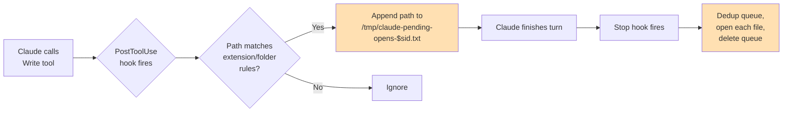

# claude-auto-open — Project Guide

## What This Tool Does

Two Claude Code hooks that auto-open files Claude writes for your review — `.env` files, images, drafts, and anything inside a hidden folder. Opens them once, at the end of Claude's turn, even if the same file was written multiple times while Claude was working.

## Architecture



The orange boxes are where state lives — a tiny per-session queue file in `/tmp`. Everything else is stateless. The whole thing is under 10 lines of shell across two hook commands.

## Guided Setup

### Step 1: Install

```bash
./install.sh
```

This merges the hooks into `~/.claude/settings.json`, backing up your existing file to `~/.claude/settings.json.bak-<timestamp>` first. It's idempotent — running it twice won't duplicate the hooks.

Then either run `/hooks` inside Claude Code or restart it. The settings watcher only picks up hook changes on session start or a manual `/hooks` reload.

### Step 2: Decide what file types trigger

The default list lives in `hooks.json`, in the `case` statement of the `PostToolUse` hook:

```
*.png|*.jpg|*.jpeg|*.gif|*.webp|*.pdf|*.svg|*.md|*.txt|*.html|*.docx|*.env|*/.env|*/.env.*|*/.*/*
```

| Category | Patterns |
|---|---|
| Images | `*.png` `*.jpg` `*.jpeg` `*.gif` `*.webp` `*.pdf` `*.svg` |
| Drafts | `*.md` `*.txt` `*.html` `*.docx` |
| Env files | `*.env` `*/.env` `*/.env.*` |
| Hidden folders | `*/.*/*` (path contains a dotted directory segment) |

To add a type, edit the pattern and reinstall (or edit `~/.claude/settings.json` directly). Example — adding `.csv`:

```
*.png|*.jpg|...|*.docx|*.csv|*.env|*/.env|*/.env.*|*/.*/*
```

### Step 3: OS-specific open command

The `Stop` hook uses macOS `open`. For other platforms, swap the command in `hooks.json` before installing:

| OS | Command |
|---|---|
| macOS | `open "$p"` (default) |
| Linux | `xdg-open "$p"` |
| WSL | `explorer.exe "$(wslpath -w "$p")"` |

### Step 4: Change the trigger timing (optional)

Default: files open at `Stop` (end of turn). Pros: one file per path, no flicker from iterations.

Alternative: open instantly inside `PostToolUse`, skip the queue. Pros: files open as they're written. Cons: if Claude writes `logo.png` five times in a turn, it opens five times.

To switch to instant, replace both hooks with a single `PostToolUse`:

```json
{
  "type": "command",
  "command": "f=$(jq -r '.tool_input.file_path // empty'); [ -n \"$f\" ] && [ -e \"$f\" ] && case \"$f\" in *.png|*.md|*.env|*/.*/*) open \"$f\" ;; esac 2>/dev/null || true"
}
```

Remove the `Stop` hook entirely.

## Key Rules

- Opens once per unique file path per turn. Dedup happens at flush time.
- Queue lives at `/tmp/claude-pending-opens-<session_id>.txt`. Wiped on `Stop`.
- If a session crashes before `Stop` fires, the queue file is orphaned in `/tmp` — harmless; the OS cleans `/tmp` eventually.
- The `Stop` hook fires on normal turn end, `/clear`, `/compact`, and `/resume`. All of these flush the queue.
- Opens happen in the background — they don't block Claude.
- Dotfiles at the root level (e.g., `~/.env`) match the `*.env` and `*/.env` patterns, not the "hidden folder" rule — the hidden folder rule is for *containing directories* like `~/.config/foo.yaml`.

## Common Commands

```bash
./install.sh                              # merge hooks into settings
./uninstall.sh                            # remove them (leaves other hooks alone)
jq '.hooks' ~/.claude/settings.json        # inspect what's installed
```

## What Stays the Same (UNIVERSAL)

- `hooks.json` — hook JSON. The extension patterns and queue/flush pattern are platform-agnostic.
- `install.sh` / `uninstall.sh` — pure shell + jq, portable across macOS and Linux.

## What Needs Adapting (INTEGRATION)

- The `open` command in the `Stop` hook — macOS-specific. Step 3 covers Linux and WSL.
- The extension patterns — personal preference. Step 2 covers adding/removing.

## Why Two Hooks? (Design Note)

The naive version is one hook: "when Write finishes, `open` the file." That works, but Claude often iterates — generate, look at it, regenerate. You'd see five tabs pop open for one image.

The fix: track paths during the turn, dedup, open each unique path once when the turn ends. The queue file is a dead-simple per-session tempfile (`$sid` from the hook input keeps sessions isolated). The `Stop` hook reads it, runs `awk '!seen[$0]++'` to dedup while preserving order, opens each, deletes the queue.

Total state: one text file. Total code: about 250 bytes per hook.

## Environment Variables

None.
